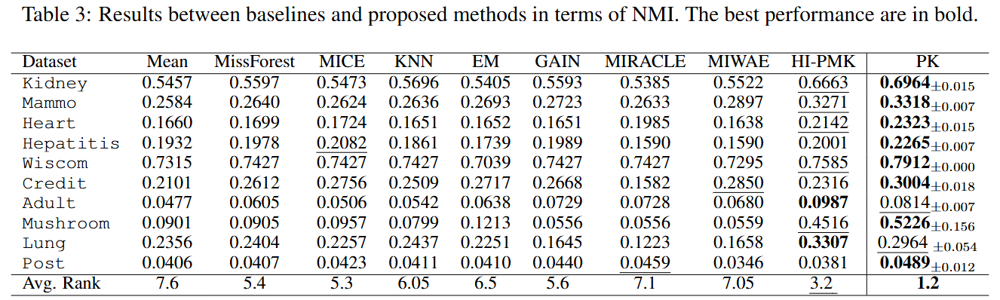

# proximity-kernel

## Overview

Proximity kernel is a data depedent kernel for imcomplete data similarity measure.

## Installation

### Requirements

```bash
pip install numpy scipy scikit-learn
```


## Quick Start

### Basic Usage

```python
from pk import PK
pk = PK(n_bins_per_dim=4)     # n_bins_per_dim is the only parameter

New_feature = pk.fit_transform(X)      # X is missing data
```

The reproduce result of 10 datasets is shown in demo.ipynb.

## Performance



## Contributing

Contributions are welcome! Please feel free to submit a Pull Request. For major changes, please open an issue first to discuss what you would like to change.

## Contact

For questions and support, please open an issue in the GitHub repository.
